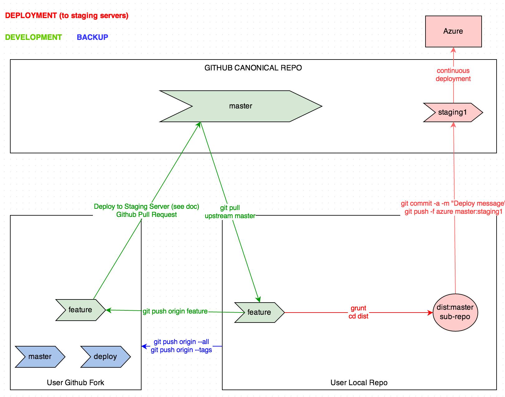
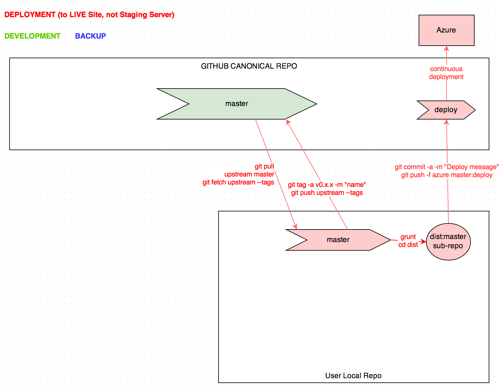

[Here are the instructions](https://docs.google.com/a/andrewzey.com/document/d/1ATH1JQFUmxjeJNobihRMTTscBbK-KqRl5jypVnzwKEQ/edit)
Also viewable [here](CONTRIBUTING.md).

Here is the Draw.io hosted version of the Git Development Workflow: [https://drive.google.com/a/andrewzey.com/file/d/0B9imntQWc7rJUDRFbVQtOWtOV0k/edit?usp=sharing](https://drive.google.com/a/andrewzey.com/file/d/0B9imntQWc7rJUDRFbVQtOWtOV0k/edit?usp=sharing)

Here is the Draw.io hosted version of the Git Live Deployment Workflow: [https://drive.google.com/file/d/0B9imntQWc7rJSDh5cDJzTzYyMTQ/edit?usp=sharing](https://drive.google.com/file/d/0B9imntQWc7rJSDh5cDJzTzYyMTQ/edit?usp=sharing)

TODO: Embed instructions directly into the body of this file.
